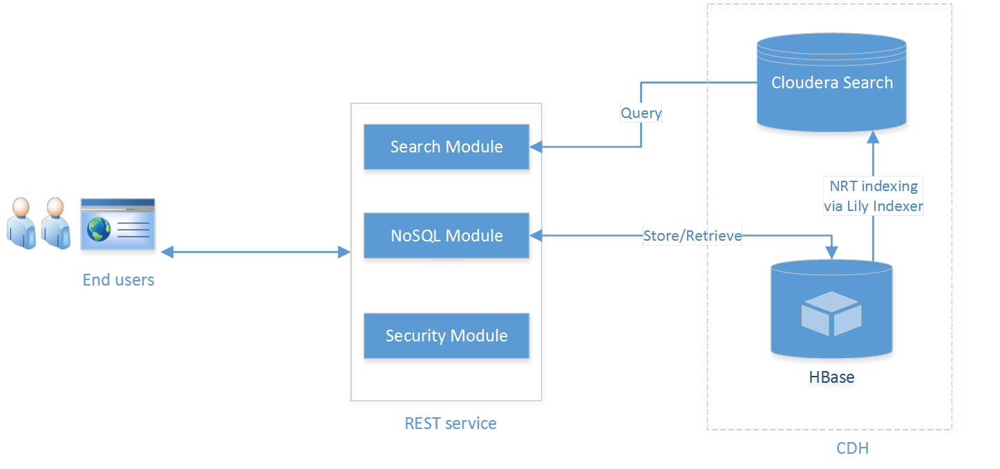
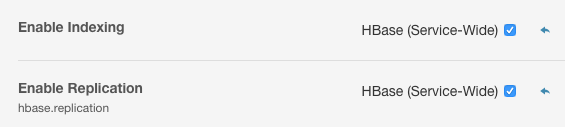
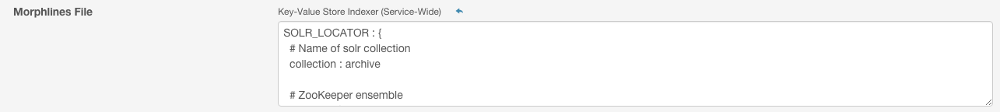

# archive
An archive app based on CDH, providing upload and retrieval REST API for small files (< 10MB).

#### 1. Background
Many customers have millions of small files, e.g. customer service audio recordings, research papers, etc. Previously, they have to buy a dedicated file archive system for those files to meet 2 most straightforward requirements:

* storage
* retrieval, based on metadata search and/or full-text search

After deploying Hadoop, specifically **Cloudera distribution of Hadoop (EDH)**, customers want to ingest different data sources into one central data hub (a.k.a [Data lake](https://en.wikipedia.org/wiki/Data_lake)) for further analysis. 

One solution would be storing small files directly in HDFS, but that's not efficient, and HDFS does not support miscellaneous indexing feature neither. 
Further more, we also want to decouple clients (web UI or mobile app) from Hadoop, so the design would look like below:



In this new solution, we apply **HBase** to store file content and metadata, in the meantime, **Lily indexer** will capture any metadata changes automatically in HBase and re-index them in **Cloudera search** (powered by Solr). In the middle there is a web service decoupling end users from CDH, in this case we leverage [ **CXF-JAXRS** ](http://cxf.apache.org/docs/jax-rs.html).

#### 2. Prerequisites

**enable hbase replication feature**

To take advantage of MOB, you have to use HFile version 3 (The MOB feature is transparent to the client).

```xml
HBase Service Advanced Configuration Snippet (Safety Valve)
<property>
  <name>hfile.format.version</name>
  <value>3</value>
</property>
```



**deploy key-value store indexer and configure mophlines**




For more details, go see [morphline configuration file](https://github.com/yeleid/archive/blob/master/bin/solr/morphline.conf)

#### 3. Archive System Setup

**clone code repository**

    git clone https://github.com/yeleid/archive

**compile and package**

    mvn clean package
    
**setup environment**

This step includes hbase table creation, solr collection creation and lily indexer registration.

    bin/setup.sh
    
**run archive service**

    bin/archive.sh
    
    then you should be able to see the log as follows:
    16/01/14 04:20:10 INFO solutions.ArchiveServer: Start Archive Server.
    
    
#### 4. Demonstration

**check the service is running**

    bin/info.sh
    
    then you should be able to see the log as follows:
    Archive System 0.4 @yeleid
    
**upload a file (< 10MB) that to be archived**

    bin/upload.sh
    
    by default, this file will be associated with id '123'. if you change ID="123" to ID="new" in script bin/upload.sh, archive service will return an uuid for this new file.
    
**update metadata for an archived file**

    bin/update.sh
  
**serach metadata**

    bin/search.sh
    
    in the current implementation, archive service works like a Solr proxy:
    {"content":"{\"responseHeader\":{\"status\":0,\"QTime\":1,\"params\":{\"q\":\"a:alex\",\"wt\":\"json\"}},\"response\":{\"numFound\":1,\"start\":0,\"docs\":[{\"id\":\"123\",\"f\":\"test.txt\",\"a\":\"alex\",\"_version_\":1523391910243205120}]}}\n","status":200}

**query metadata given file id**

    bin/retrieve.sh
    
    then you should be able to see the log like below:
    {"category":null,"author":"alex","filename":"test.txt"}
    
**download the archived file given file id**

    bin/download.sh
    
    by default, the downloaded file will be put into directory '/tmp/staging/'.
    
#### 5. References

*solrctrl reference*

    http://www.cloudera.com/content/www/en-us/documentation/enterprise/latest/topics/search_solrctl_ref.html
    
*extractHBaseCells Morphline command*
    
    http://www.cloudera.com/content/www/en-us/documentation/enterprise/latest/topics/search_hbase_batch_indexer.html
    
*using Lily HBase NRT Indexer service*

    http://www.cloudera.com/content/www/en-us/documentation/enterprise/latest/topics/search_use_hbase_indexer_service.html
    
*indexer configuration*

    https://github.com/NGDATA/hbase-indexer/wiki/Indexer-configuration
    
    